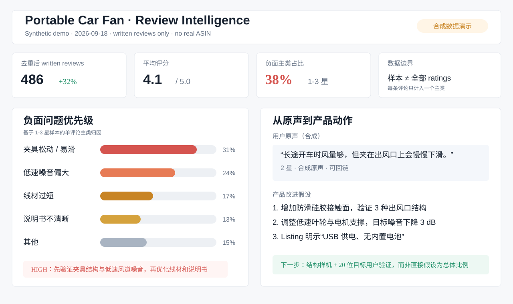

# Amazon Review Intelligence Skill

把 Amazon written reviews 变成可核对、可交付、可执行的产品决策证据。

它适合产品经理、运营、市场研究和研发团队：输入 ASIN、评论链接或已有评论文件，输出原始证据、Excel 数据集、离线 HTML 洞察，以及可以进入产品迭代的需求主题和改进假设。

## 解决什么问题

Amazon 评论通常分散在不同页面和文件里，既难以批量整理，也容易把“评分数量”误当成“已读取的评论数量”。这个 Skill 将评论正文、来源、日期、星级和媒体信息保留下来，再统一去重、归因和交付，让团队可以回答：

- 用户真实抱怨的是什么，哪些只是孤立事件？
- 用户为什么喜欢这个产品，哪些卖点值得放大？
- 哪些问题会触发退货、差评或换品牌？
- 下一轮产品、包装、说明书、适配性或 Listing 应该先改什么？

## 核心优势

- **从采集到决策闭环**：不止导出评论，还提供原声、主题、优先级和可验证的产品改进假设。
- **证据可追溯**：保留完整原文、评论链接、来源、日期和覆盖限制；原文、中文翻译、中文摘要分开保存。
- **口径更诚实**：明确区分 written reviews、ratings 总数和本次去重后的有效评论，不把样本包装成全量。
- **适合批量工作**：支持单 ASIN、批量 ASIN、已有 JSON/CSV/XLSX 的分析-only 模式，并可断点续跑。
- **低锁定、易复核**：输出 canonical JSON、Excel 和无需联网的单文件 HTML，可交给 BI、VOC、证据合同或研发流程继续使用。
- **主路径无需 Amazon 账号**：公开评论采集优先走无需登录的路径；遇到登录墙、验证码或 Robot Check 时不绕过安全机制，可改用用户控制的浏览器会话或已有文件。

## 如何使用

### 1. 采集并分析 ASIN

```bash
python scripts/amazon_review_scraper.py B0XXXXXXXX --mode max -o output/B0XXXXXXXX/reviews.json
```

### 2. 批量采集

```bash
python scripts/batch_review_collect.py B0AAA... B0BBB... \
  --output-dir output/batch --mode max --resume
```

### 3. 把已有评论文件转成 Excel 与 HTML 洞察

将 JSON、CSV 或 XLSX 交给 Skill，并说明：

> 分析这些 Amazon 评论，保留原声，导出 Excel，并生成中文 HTML：差评主题、正面卖点、换品牌触发器和产品改进优先级。

也可以只要求某一部分，例如“只看 1-3 星差评”或“只分析安装与兼容性”。

### 4. 继续交给其他工作流

canonical review JSON 可作为 `voice-of-customer-miner` 的 Amazon 来源，也可交给产品证据合同、竞品战卡、Discovery 或 PRD 工作流。

## 评论获取量级与边界

以下是单 ASIN 的请求上限策略，不是对最终唯一评论数的承诺：

| 模式 | 适用场景 | 采集策略 |
| --- | --- | --- |
| `basic` | 快速预览、验证页面可用性 | 少量分页，优先返回可见结果 |
| `full` | 常规研究 | 5 个星级分组，每组最多 12 页请求 |
| `max` | 尽量扩大样本 | 5 个星级 × 4 个排序组合 × 每组合最多 12 页，最多约 240 个分页请求 |
| 浏览器回退 | 接口结果为 0、明显不完整或指定最近评论 | 通常检查最近/可见评论页，策略上最多约 10 页 |

实际唯一评论数量取决于 marketplace、页面返回、重复评论、排序重叠和访问限制。这里的数量只代表 written reviews，不等于 Listing 上显示的 ratings 总数，也不承诺覆盖全部历史评论。

主采集路径不需要登录 Amazon 账号。若 Amazon 展示登录墙、验证码或 Robot Check，Skill 会停止并说明缺口；浏览器回退只能使用用户授权的浏览器会话，不能绕过安全机制。

## 你会得到什么

- **Canonical JSON**：完整评论正文、标题、星级、日期、作者、变体、验证状态、Helpful、图片/视频 URL、来源和稳定 ID。
- **Excel 工作簿**：批量 `all_reviews`、摘要和可继续分析的原始数据；单 ASIN 也可输出精简表。
- **离线 HTML 报告**：数据概览、负面 TOP10、正面 TOP10、兼容性、原声分页、中文翻译和改进建议矩阵。
- **产品决策层**：Recurring / concentrated / isolated 主题、竞品弱点、换品牌触发器、验证问题和下一步实验假设。

## 实际应用案例（合成数据演示）

下面的案例模拟一个“便携式车载风扇”产品。数据是合成的，仅用于展示输出形态，不代表真实 Amazon ASIN、真实评论或真实统计。



- [打开完整 HTML 案例](examples/synthetic-review-insight.html)
- 案例结论示例：优先修复夹具稳固性与低速噪音；保留 USB 供电和长途降温卖点；下一步用结构样机和 20 位目标用户验证。

## 使用边界

这是面向产品决策的公开评论证据工作流，不是统计学意义上的总体抽样、缺陷率证明或因果研究。不要把单条评论当成人群比例；不要把 ratings 数量当成已读取正文数量；不要在 CAPTCHA、登录墙或账户警告出现时尝试绕过。

## License

当前仓库采用保留所有权利（All rights reserved）方式发布。未经作者许可，不得复制、再发布、改名后分发或将其中的实现作为独立商业产品提供。
