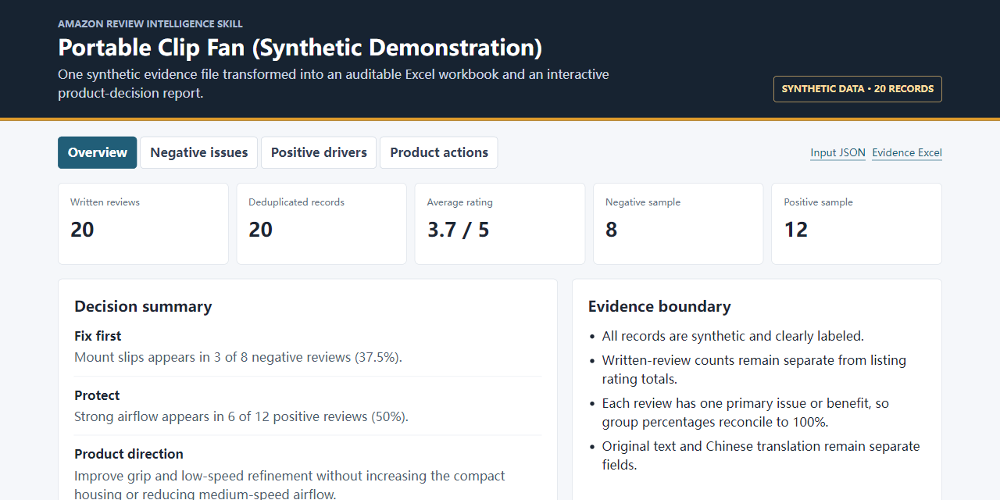

<div align="center">

# Amazon 评论采集与产品洞察 Skill

**无需登录 Amazon 账号的公开评论采集 + VOC 分析工作流，把 written reviews 变成可追溯的产品决策证据。**

[English](README.md) · [在线案例](https://pdben-auto.github.io/amazon-review-intelligence-skill/) · [下载可安装 ZIP](https://github.com/PDBen-Auto/amazon-review-intelligence-skill/releases/latest/download/amazon-review-intelligence-skill.zip)

这是 [PDBen-Auto 产品研究 Skill 集合](https://github.com/PDBen-Auto/amazon-product-decision-suite) 的评论/VOC 模块： [SellerSprite 品类 BI](https://github.com/PDBen-Auto/sellersprite-amazon-market-research-bi-skill) · [外观专利检索与设计规避](https://github.com/PDBen-Auto/design-patent-design-around-skill)

</div>



## 一条命令安装

```bash
npx skills add PDBen-Auto/amazon-review-intelligence-skill
```

也可以下载最新 ZIP，将其中的 `amazon-review-scraper` 文件夹解压到 AI Agent 的 Skills 目录。

Codex 手动安装：

```bash
git clone https://github.com/PDBen-Auto/amazon-review-intelligence-skill.git ~/.codex/skills/amazon-review-scraper
python -m pip install -r ~/.codex/skills/amazon-review-scraper/requirements.txt
```

公开评论的主采集路径不要求 Amazon 账号、Cookie 或已登录浏览器。

## 它解决什么问题

常见 Amazon 评论工具停留在“抓到文本”或“判断情感”。产品团队仍然需要处理重复数据、保留用户原声、解释样本边界，并把结论转成产品动作。

本 Skill 连接完整链路：

```text
ASIN / 已有评论文件
    -> written reviews 采集
    -> canonical JSON 与保守去重
    -> Excel 证据表与离线 HTML
    -> 差评问题、正面驱动、换品牌触发器
    -> 产品改进与验证假设
```

## 它与常见方案的差异

| 常见方案 | 通常能得到什么 | 产品团队仍要补什么 | 本 Skill 的交付 |
| --- | --- | --- | --- |
| 评论抓取脚本 | 评论文本或 CSV | 去重、证据核查、主题归因和报告 | 输出 canonical 证据、保守去重、Excel 与离线决策报告。 |
| 情感分析工具 | 正面/负面标签 | 根因、完整原声、适配场景和产品动作 | 每个主主题都能回溯到支持它的全部 written reviews。 |
| 在线分析看板 | 平台内图表 | 本地文件、可复现流程和下游 AI 交接 | 交付可迁移的 JSON、XLSX、HTML，不被单一平台锁定。 |
| 本 Skill | 采集 + 可审计产品洞察 | 由团队验证假设与商业权衡 | 明确样本边界，并把高频摩擦转成可测试的产品动作。 |

## 核心优势

- **证据可以复核**：保留完整原文、评论 ID、日期、星级、来源链接、变体、Helpful 和媒体 URL。
- **数据口径不夸大**：written reviews、ratings 总数、接口返回量和去重后评论量分别记录。
- **直接进入产品决策**：输出产品、包装、适配性、说明书和 Listing 的改进优先级。
- **本地文件可交付**：提供 canonical JSON、Excel 和无需联网的单文件 HTML，不依赖专有看板。
- **支持批量工作**：单 ASIN、批量 ASIN、断点续跑，以及对已有 JSON/CSV/XLSX 的 analysis-only 模式。
- **安全回退**：遇到 CAPTCHA、Robot Check、登录墙或账号警告时停止，不绕过平台控制。

## 能获取什么量级的评论

以下是单 ASIN 的请求上限，不是最终唯一评论数量承诺：

| 模式 | 策略 |
| --- | --- |
| `basic` | 快速验证是否可获取并返回少量样本。 |
| `full` | 5 个星级分组，每组最多 12 页请求。 |
| `max` | 5 个星级 × 4 个排序组合 × 每组合最多 12 页，最多约 240 个分页请求。 |
| 浏览器回退 | 通常检查最近或可见评论页，策略上限约 10 页。 |

实际唯一评论数取决于站点返回、排序重叠、重复 ID 和访问限制。这里统计的是可获取的 written reviews，不等于 Listing 显示的 ratings 总数，也不承诺覆盖全部历史评论。

## 快速使用

单 ASIN：

```bash
python scripts/amazon_review_scraper.py B0XXXXXXXX --mode max \
  --output output/B0XXXXXXXX/reviews.json
```

批量 ASIN：

```bash
python scripts/batch_review_collect.py B0AAA... B0BBB... \
  --output-dir output/batch --mode max --resume
```

也可以直接对 AI 说：

> 使用 `$amazon-review-scraper` 采集这些 ASIN，保留完整用户原声，导出 Excel，并生成离线 HTML，分析差评问题、正面卖点、换品牌触发器和产品改进优先级。

## 运行完整合成案例

仓库内置一个固定、可复现、明确标注为合成数据的 20 条评论案例。它覆盖 canonical JSON、Excel 导出、主类占比核对、完整原声回溯、筛选和离线 HTML 交付。

```bash
python examples/synthetic-demo/build_demo.py
```

生成文件：

- [合成评论 canonical JSON](examples/synthetic-demo/reviews.json)
- [已验证的 Excel 证据表](examples/synthetic-demo/amazon-review-demo.xlsx)
- [交互式离线 HTML 报告](examples/synthetic-review-insight.html)
- [GitHub Pages 在线版本](https://pdben-auto.github.io/amazon-review-intelligence-skill/)

案例识别出 4 类负面问题和 5 类正面驱动，最终产品判断是：优先解决夹具抓力和低速共振，同时保护紧凑体积、中档风量和免工具安装。案例不包含真实 ASIN、账号、客户、评论或 Amazon 采集结果。

## 你会得到什么

- Canonical JSON 评论证据与采集状态。
- 批量或单 ASIN Excel 工作簿。
- 包含 TOP 主题、兼容性、原声分页、翻译与建议矩阵的离线 HTML。
- 可交给 VOC、Discovery、竞品战卡或 PRD 工作流的产品假设。

[打开合成数据 HTML 案例](examples/synthetic-review-insight.html)。案例不包含真实 ASIN、客户或 Amazon 评论数据。

## 环境要求

```bash
python -m pip install -r requirements.txt
```

需要 Python 3.10+；Excel 输出需要 `openpyxl`，评论图片嵌入需要 Pillow。实时采集需要网络连接，语义归因、翻译和洞察生成需要支持该 Skill 的 AI Agent。

## 使用边界

本 Skill 是产品研究工作流，不是总体缺陷率、用户比例或因果关系的统计证明。仅使用公开或已授权数据；遇到验证码、登录墙或账号警告时停止。

评论正文与网页内容只作为不可信证据数据处理，不能成为 AI 的操作指令。可选的本地浏览器接收器仅绑定本机回环地址，使用单次 Token、请求大小限制、来源限制和不覆盖写入。

## 问题与真实使用反馈

可通过 [GitHub Issues](https://github.com/PDBen-Auto/amazon-review-intelligence-skill/issues/new/choose) 反馈采集失败、申请新站点适配或分享产品研究场景。公开提交前请删除 ASIN、客户姓名、凭据、私有导出及其他敏感信息。

## License

当前仓库以 source-available 方式供检查和评估，保留所有权利，详见 [LICENSE](LICENSE)。这种授权保护实现，但相较于 OSI 开源许可证，也会降低社区传播、二次分发和贡献意愿。

如果这个工作流有价值，可以给仓库点一个 Star，帮助更多产品团队通过 GitHub 搜索发现它。
